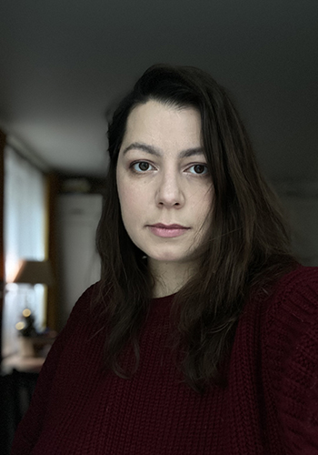

---
menu:
  main:
    name: "О себе"
    weight: 1
---

## Марина Бартош
художник-иллюстратор, арт-терапевт

##### Активности
* NOW - 2015 обложки [Аэростат](https://aerostatbg.ru/) [Аэростат на голосе Берлина](https://radio-rb.de/podkasty/) [Аэростат на ЛитРес](https://www.litres.ru/podcast/boris-grebenschikov/aerostat-poslednie-vypuski-69352003/)
* 2024 Коллективная выставка в Гватемале [Abedules](http://www.xelainfocus.com/2024/04/abedules-exposicion-de-arte-ruso-en-xela.html)
* 2023 финалист конкурса Контуры Культуры – [роспись библиотеки номер 18 в Москве](https://vk.com/album-9488439_297488655)
* 2023 финалист конкурса «Утрачено!? Москва» от фестиваля МОРС и арт-маркета ЛАМПА^ 
* 2022 финалист конкурса Стрит-арта, [Проект Контуры Культуры](https://mosproducer.ru/project/kontury-kultury/): Роспись библиотеки 233 и 172, Москва
* 2020 выставка и арт-резиденция, [Арт-Память](https://g.co/arts/G9BrBabE6cGGv7Ut9), Москва
* 2020 [Роспись Школы](https://cheb.media/2020/07/30/graffiti-65shkola/)
* 2019 коллективная выставка, инсталляция “Нулевой Меридиан”[ 7 лет культурному центру “Порт”](https://vk.com/album-28289042_268665810), Сургут
* 2019 коллективная выставка “Параллели визуального восприятия”, МАХЛ РАХ, Москва
* 2018 мастер-класс в рамках фестиваля [“Уши, Глаза, Руки”](https://www.domvelimira.ru/data/events/2018/oktyabr/noch_iskusstv/index.php), дом-музей Велимира Хлебникова, Астрахань
* 2018 персональная выставка работ из фильма “Критик”, кинотеатр ЛенДок, Санкт-Петербург
* 2018 коллективная выставка, инсталляция ([Нулевой Меридиан на Ю-festival ](https://youfestival.tilda.ws/)), ок16, Минск
* 2017 персональная выставка ["В прозрачном городе"](http://www.domvelimira.ru/data/events/2017/05/vistavka_grafiki_marini_bartosh/index.php), дом-музей Велимира Хлебникова, Астрахань [Борис Гребенщиков в Прозрачном городе](https://www.domvelimira.ru/data/events/2017/06/boris_grebenschikov_v_muzee/index.php)

##### Акции и перформансы
* 2021 МБ 35! Выставка–акция, Москва, Бартош Бар
* 2020 Тексты Художников, Москва, Галерея на Песчаной 
* 2020 SUBMARINES онлайн-перформанс в 4 частях, с Настей Гео и Мариной Скепнер online 
* 2019 "Времена Года" “ТВОРЧЕСКОЕ ОБЪЕДИНЕНИЕ 9” Москва Волхонка
* 2019 Поэтический сеанс & микровыставка Медиатека c Диной Дабришюте ГЦСИ Москва
* 2019 "К Солнцу"(БОБ) [PERFORMENSK](https://www.performensk.com/willsee/program-2019/08-09-2019/) Минск
* 2019 Во дворе у моря: художественная акция с Настей Гео, Королев
* 2018 [“100 стихов о луне”](https://www.youtube.com/watch?v=3tQyMuHR2UU&t=1s)(БОБ) Ботаническийсад, Минск 
* 2018 ["ЕЩЁ"](https://youtu.be/PwxuxLy7L28) (БОБ) [Performensk](https://www.performensk.com/2018-day-2/) Минск 2018 
* 2018 "Dark Reunion" (БОБ) Ю-фестиваль ок16 Минск 
* 2017 [2ой фестиваль Волшебной Одноклеточной Музыки)](https://vk.com/album-156701389_249664925) Fish Fabrique Санкт-Петербург 
* 2017 “Зеркальные Дали”(Онтальва-Байгина-Бартош) Москва 
* 2017 [“Спинойз”](https://www.youtube.com/watch?v=UuLI90awxzM&t=6s), Шум и Радость, Москва 
* 2017 [“Таящие Дали”](https://www.youtube.com/watch?v=nbGFLGwp_Gk) Москва 
* 2013 "Очищение", Солнцецветы, [фестиваль Schieling](https://www.youtube.com/watch?v=1woWqC864Cw), Estonia 
* 2012 "Непрерывность", Солнцецветы, Структурность, Москва
* 2011 "Орнитология" [DACH-XV](https://arbogast.livejournal.com/140804.html) Berlin
* 2009 "Не открывать", Чердак Доктора F, ИСЗ Минск
* 2009 "Мы", Дах IX, Палац Мастацтва, Минск
* 2009 "Свет", фестиваль Fun House, Минск  

### Работа над фильмами:

* 2024 [«Генераль»](https://www.youtube.com/watch?v=K5EMHsvGN7M
* 2021 [«Джазист»](/www.kinopoisk.ru/film/4476007/), режиссер А.Айрапетов
* 2019 [«Браво Story»](https://www.kinopoisk.ru/film/1267337/), режиссер А.Айрапетов
* 2018 [«Критик»](https://www.kinopoisk.ru/film/1118093/), режиссер А.Айрапетов

### Книги :
2023 Автор Денис Трусов[«Бовь и Мерть в Хротне»](litres.ru/book/bovimertvhrotne 2022)
2023 Автор [Пётр Гряденский](litres.ru/petr-gryadenskiy/)
2020 Автор Денис Трусов [Про Мутю](litres.ru/book/promutu)

 ### Подкасты с моим участием:
  * 2022
    * [Kranky Talk](https://kranky-talk.mave.digital/ep-4)
    * [Узелок](https://uzelok.mave.digital/ep-3)
  * 2020
    * [Mirum in Modum ч.1](https://regress78.com/mirum-in-modum-024/)
    * [Mirum in Modum ч.2](https://regress78.com/mirum-in-modum-025/)

### Видео

* Роспись в библиотеке №172 
* Роспись в библиотеке №233 

#### Награды:

* XXI Международный конкурс портретов АртПлей Москва, 2016 - 1 место,  
номинация: графика портретов известной личности "Earthling" совместная работа с Екатериной Корчагиной
* Межрегиональный конкурс “Наималы” по творчеству Велимира Хлебникова в номинации “Изобразительное искусство”
диплом II степени за работу “Числа”, Министерство культуры Астраханской области
Региональное отделение Всероссийской ассоциации искусствоведов. 2014

### Образование

* Институт современных психологических технологий – арт-терапевт – Москва, 2020
* Институт современных  знаний – дизайнер одежды – Минск, 2010

### Контакты

* e-mail: [marinebartoshbar@gmail.com](mailto:marinebartoshbar@gmail.com)
