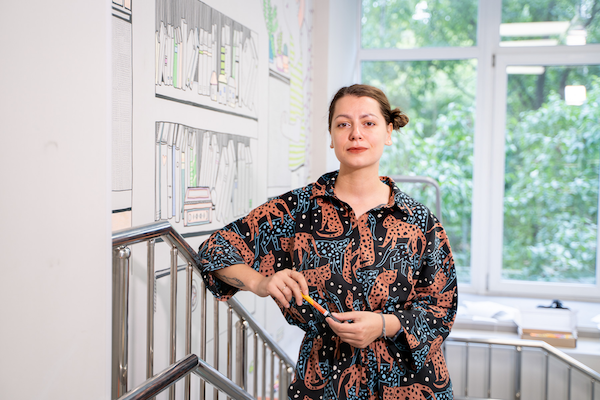

---
menu:
  main:
    name: "О себе"
    weight: 1
---

## Марина Бартош

художник-иллюстратор, арт-терапевт

### Образование 

* Институт современных психологических технологий – арт-терапевт – Москва, 2020
* Институт современных  знаний – дизайнер одежды – Минск, 2010

##### чё я делала

* 2022 финалист конкурса Стрит-арта, [Проект Контуры Культуры](https://mosproducer.ru/project/kontury-kultury/): Роспись библиотеки 233 и 172, Москва
* 2020 выставка и арт-резиденция, [Арт-Память](https://g.co/arts/G9BrBabE6cGGv7Ut9), Москва
* 2020 [Роспись Школы](https://cheb.media/2020/07/30/graffiti-65shkola/)
* 2019 коллективная выставка, инсталляция “Нулевой Меридиан”, культурный центр “Порт”, Сургут 
* 2019 коллективная выставка “Параллели визуального восприятия”, Московский академический художественный лицей Российской академии художеств, Москва 
* 2018 мастер-класс в рамках фестиваля “Уши, Глаза, Руки”, дом-музей Велимира Хлебникова, Астрахань
* 2018 персональная выставка работ из фильма “Критик”, кинотеатр ЛенДок, Санкт-Петербург
* 2018 коллективная выставка, инсталляция “Нулевой Меридиан”(коллаборация с Павлом Сучковым), ок16, Минск
* 2017 персональная выставка ["В прозрачном городе"](http://www.domvelimira.ru/data/events/2017/05/vistavka_grafiki_marini_bartosh/index.php), дом-музей Велимира Хлебникова, Астрахань

### Работа над фильмами:

* 2021 «Джазист», режиссер А.Айрапетов
* 2019 «Браво Story», режиссер А.Айрапетов
* 2018 [«Критик»](https://www.kinopoisk.ru/film/1118093/), режиссер А.Айрапетов
 
 ### Подкасты с моим участием:
  #### 2022 
  [Kranky Talk](https://kranky-talk.mave.digital/ep-4)  
  [Узелок](https://uzelok.mave.digital/ep-3)

#### Награды:

* XXI Международный конкурс портретов АртПлей Москва, 2016 - 1 место, графика портретов известной личности "Earthling" совместная работа с Екатериной Корчагиной 
* Межрегиональный конкурс “Наималы” по творчеству Велимира Хлебникова в номинации “Изобразительное искусство” диплом II степени за работу “Числа” Министерство культуры Астраханской области Региональное отделение Всероссийской ассоциации искусствоведов. 2014
