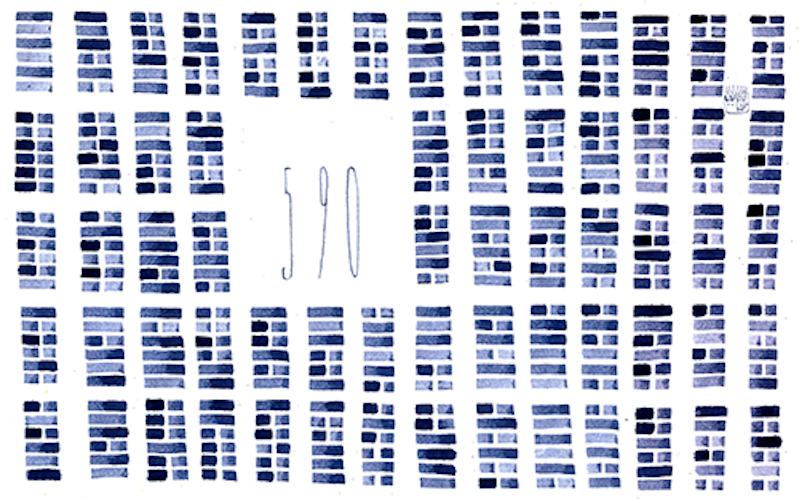
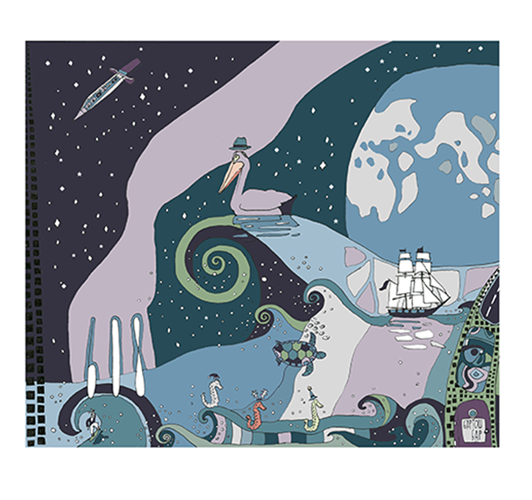
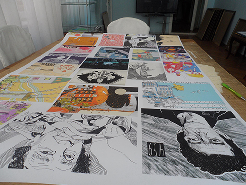
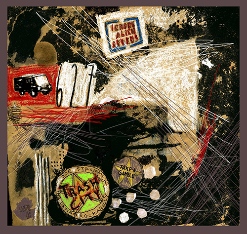

---
menu:
  main:
    name: "Аэростат"
    weight: 2
---

Аэростат - авторская радиопередача Бориса Гребенщикова, выходяая в эфир Радио России и Радио Культура, начиная с 2005 года.  С 2022 года передача выходит только в интернет-формате, например в эфире интернетрадио ЭХО FM. в 2017 году в Доме-музее Велимира Хлебникова прошла выставка, собранная из аэростатных иллюстраций, её посетил сам Борис Борисович.

  
 
 
  
 
 
  
 
 

