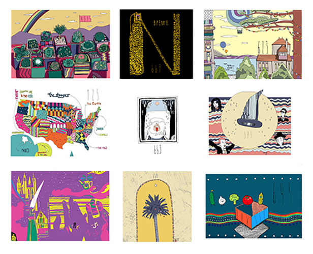
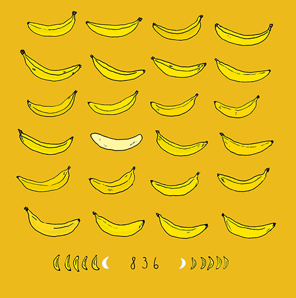

---
menu:
  main:
    name: "Аэростат"
    weight: 2
---

Аэростат - авторская радиопередача Бориса Гребенщикова, еженедельно выходящая в эфир, начиная с 2005 года. Существует множество удобных приложений и [подробных сайтов](https://aerostatbg.ru/), посвященных этой передаче. С 2022 года передача выходит в интернет-формате, например в эфире интернетрадио [Голос Берлина](https://radio-rb.de/podkasty/) и  ЭХО FM. Когда передаче исполнилось 10 лет по воле судьбы мне предложили делать иллюстрации для Аэростатного сообщества, чем я занимаюсь и поныне. В 2017 году в Доме-музее Велимира Хлебникова прошла выставка, собранная из моих Аэростатных иллюстраций, её посетили Борис Борисович и Александр Титов. [телеграм канал Аэростат](https://t.me/aerostatbg) 

  
 
 
  
 
 
  
 
 

