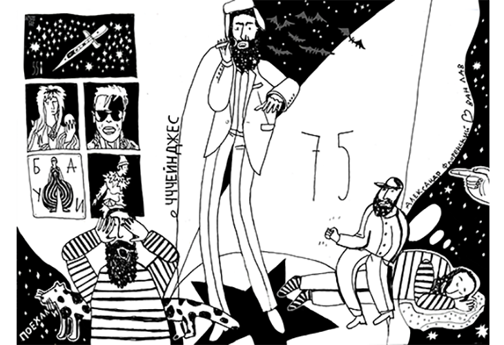
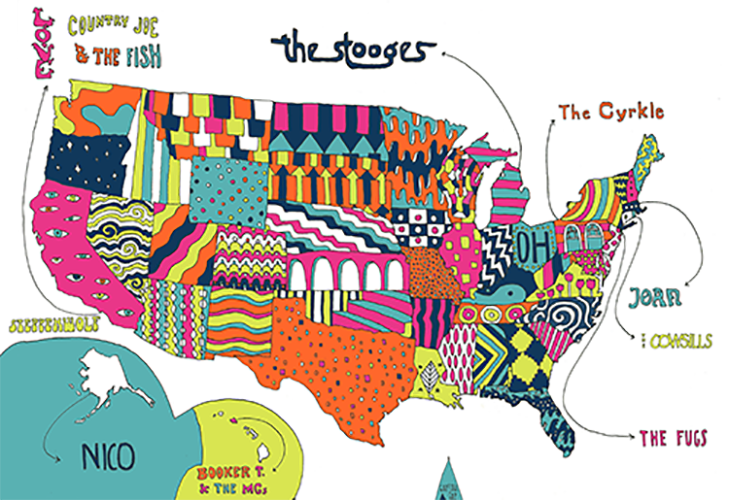
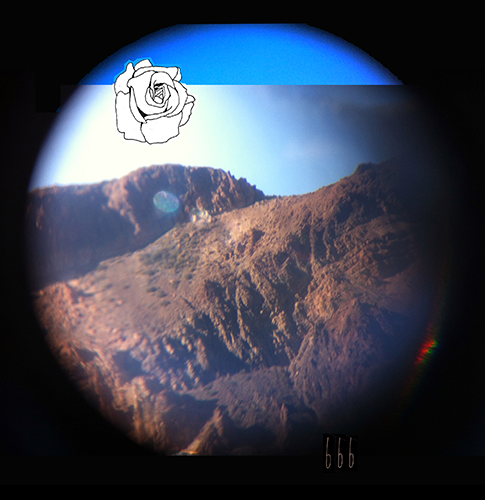
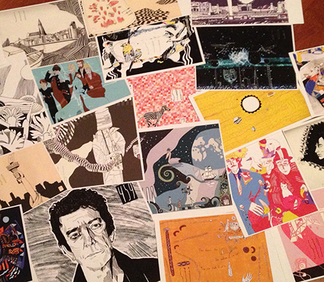

---
menu:
  main:
    name: "Аэростат"
    weight: 2
---

Аэростат - авторская радиопередача Бориса Гребенщикова, выходящая в эфир Радио России и Радио Культура, начиная с 2005 года. Являясь ее постоянным слушателем в течение нескольких лет, начиная с 2015 года, я стала создавать обложки-иллюстрации к выпускам. в 2017 году в Дому-музее Велимира Хлебникова прошла выставка, собранная из этих иллюстраций, ее посетил сам Борис Борисович. С 2022 года передача выходит в интернет-формате, [сайт Аэростат](https://aerostatbg.ru/?page=1&items_per_page=100), в эфире интернет радио ЭХО FM. 

  
 
 
  
 
 
  
 
 

