---
menu:
  main:
    name: "Графика и живопись"
    weight: 4
---
*Графика и живопись*

Из серии "Жёлтая комната" 
Акрил, масло, 2020

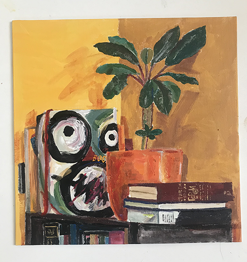
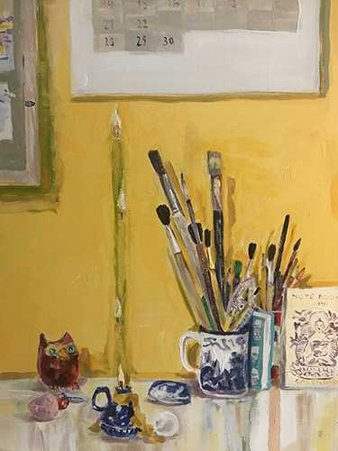
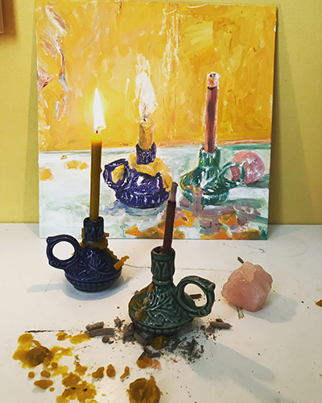

Холст, масло, 2021, посвящение роману Г.Г.Маркеса "Сто лет одиночества". Каждая картина – отдельная комната.  
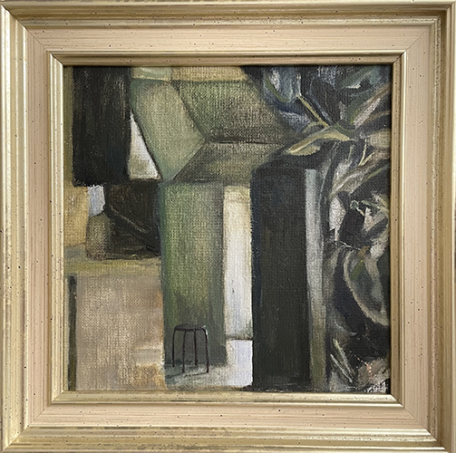 

Комната Хосе Аркадио Буэндиа

«Какой сегодня день?» Аурелиано ответил, что вторник. «Я тоже так думал, — сказал Хосе Аркадио Буэндия. — Но вдруг понял, что продолжается вчерашний понедельник. Посмотри на небо, посмотри на стены, посмотри на бегонии. Сегодня тоже понедельник».

Он единственный в доме обладал достаточной ясностью ума, позволившей ему постигнуть ту истину, что время в своём движении тоже сталкивается с препятствиями и терпит аварии, а потому кусок времени может отколоться и навечно застрять в какой-нибудь комнате.

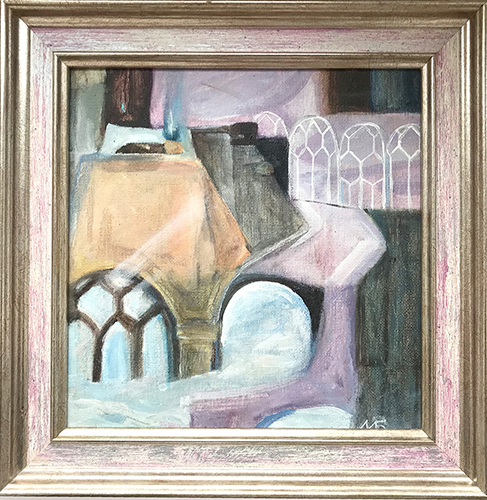 

Комната Аурелиано

 "Однажды он разжег во дворе костёр из кукол Ремедиос, украшавших его спальню со дня свадьбы. Бдительная Урсула обнаружила, что делает её сын, но не смогла остановить его. 
— У тебя сердце из камня, — сказала она. 
— Причём тут сердце, — ответил он, — в комнате полно моли."

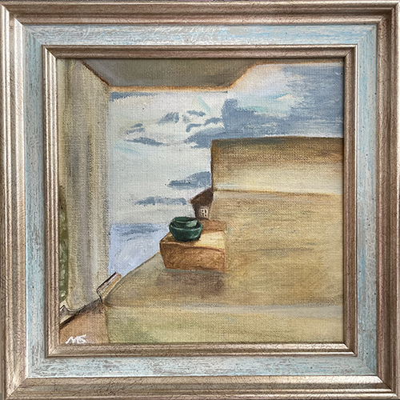 

Комната Урсулы:

"... тишина там была совсем новенькая, такая нетронутая, словно её перенесли из каких-то других мест, где никто ни разу ею не пользовался, и потому она ещё не научилась толком передавать голоса."

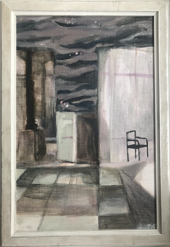
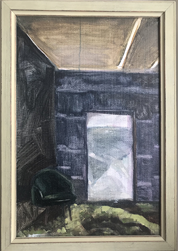
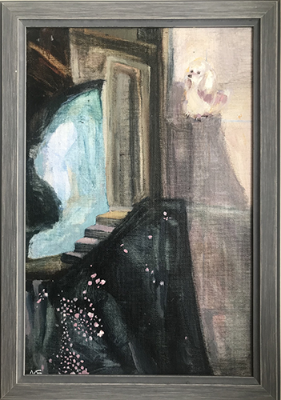

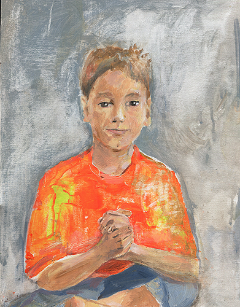
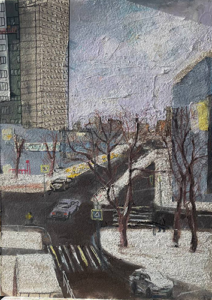
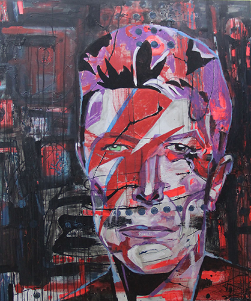
